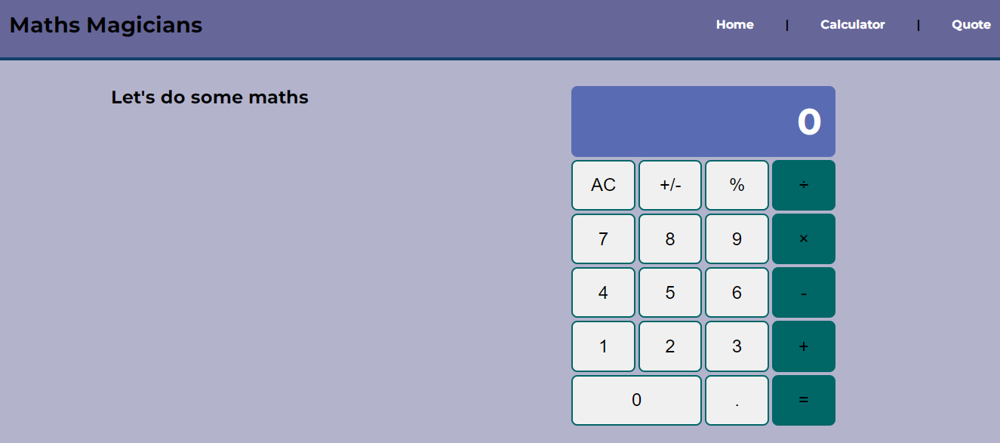

<!--
HOW TO USE:
This is an example of how you may give instructions on setting up your project locally.

Modify this file to match your project and remove sections that don't apply.

REQUIRED SECTIONS:
- Table of Contents
- About the Project
  - Built With
  - Live Demo
- Getting Started
- Authors
- Future Features
- Contributing
- Show your support
- Acknowledgements
- License

OPTIONAL SECTIONS:
- FAQ

After you're finished please remove all the comments and instructions!
-->

  <!-- You are encouraged to replace this logo with your own! Otherwise you can also remove it. -->
  
   

  <h3><b>Microverse README Template</b></h3>

<!-- TABLE OF CONTENTS -->

# 📗 Table of Contents

- [📖 About the Project](#about-project)
  - [🛠 Built With](#built-with)
    - [Tech Stack](#tech-stack)
    - [Key Features](#key-features)
  - [🚀 Live Demo](#live-demo)
- [💻 Getting Started](#getting-started)
  - [Setup](#setup)
  - [Prerequisites](#prerequisites)
  - [Install](#install)
  - [Usage](#usage)
  - [Run tests](#run-tests)
  - [Deployment](#triangular_flag_on_post-deployment)
- [👥 Authors](#authors)
- [🔭 Future Features](#future-features)
- [🤝 Contributing](#contributing)
- [⭐️ Show your support](#support)
- [🙏 Acknowledgements](#acknowledgements)
- [❓ FAQ (OPTIONAL)](#faq)
- [📝 License](#license)

<!-- PROJECT DESCRIPTION -->

# 📖 Maths Magicians project  

**Maths Magicians** is a Single Page App (SPA) that allows users to perform some basic calculations.

## 🛠 Built With 
- React

<!-- Features -->

### Key Features 

-  Create a git flow
-  Use functional Component
-  Use state and props
-  Use destructuring method
-  Use routing method
-  Test the functionality
-  Display quotes from API

(<a href="#readme-top">back to top</a>)

<!-- LIVE DEMO -->

## 🚀 Live Demo 
- Here is a [Live Demo Link](mathth.netlify.app)

## Project Screenshots

(<a href="#readme-top">back to top</a>)

<!-- GETTING STARTED -->

## 💻 Getting Started 

### Prerequisites

In order to run this project you need:
- [git](https://git-scm.com/downloads): A tool for managing source code
- [Visual Studio Code](https://code.visualstudio.com/): A source code editor
- Have a working and updated browser
- Have a local version control like git installed on your computer
- Have an account and sign in on GitHub, as online/remote version control system
- Basic knowledge in JS and React-JS

### Setup
To get a local copy of this project up and running, follow these steps.
- copy [this link](https://github.com/Donmark2k/maths-magicians.git).
- get to the directory that you want to clone the repository.
- open the command prompt in this directory.
- write `git clone github.com/Donmark2k/maths-magicians.git`
- go to the repository folder in your command prompt cd maths-magicians
- write `code .` to open the project in visual studio code.

### Install

To install this project in your local machine use

- Goto the terminal in Visual Studio code by pressing `ctrl '`
- Install the project dependencies by typing: `npm install` in the terminal.

### Usage
To run the project, execute the following command:

- In visual studio terminal type `npm start` then the project will open on your browser "http://localhost:3000".

### Run tests

- `npx stylelint "/*.{css,scss}"**`: To test css code
- `npx stylelint "**/*.{css,scss}" --fix`: To fix some CSS errors if found.
- `npx eslint .` : To test Eslint Report
- `npx eslint . --fix`: To fix some JS errors if found

### To test the application

- `npm install --save-dev jest`
- `npm test`

### Deployment

You can deploy this project using:
- Netlify

follow <a href="https://www.netlify.com/blog/2016/09/29/a-step-by-step-guide-deploying-on-netlify/">these steps</a> for example on how to deploy on netlify

(<a href="#readme-top">back to top</a>)

<!-- AUTHORS -->

## 👥 Authors 

 👤**Chukwuemeka Ochuba**

- GitHub: [@Donmark2k](https://github.com/Donmark2k)
- Twitter: [@Donmark2k](https://twitter.com/donmark2k)
- LinkedIn: [LinkedIn](https://www.linkedin.com/in/chukwuemeka-ochuba/)

(<a href="#readme-top">back to top</a>)

<!-- FUTURE FEATURES -->

## 🔭 Future Features 
- I will add time and date below the nav bar
- I will add a footer

(<a href="#readme-top">back to top</a>)

<!-- CONTRIBUTING -->

## 🤝 Contributing 

Contributions, issues, and feature requests are welcome!

Feel free to check the [issues page](https://github.com/Donmark2k/maths-magicians/issues).

(<a href="#readme-top">back to top</a>)

<!-- SUPPORT -->

## ⭐️ Show your support 

[Victor Chiemerie](https://github.com/Victor-chiemerie) has been of tremendous help so far.
- Give a ⭐️ if you like this project!

(<a href="#readme-top">back to top</a>)

<!-- ACKNOWLEDGEMENTS -->

## 🙏 Acknowledgments 

I would like to appreciate [Microverse](https://www.microverse.org/) for providing the resources and the platform for us to be a Professional full-stack developer.

(<a href="#readme-top">back to top</a>)

<!-- FAQ (optional) -->

## ❓ FAQ (OPTIONAL) 

- **[Are you sure that you are owner of this work]**

  - [Yes,]

(<a href="#readme-top">back to top</a>)

<!-- LICENSE -->

## 📝 License 

This project is [MIT](MIT.md) licensed.

(<a href="#readme-top">back to top</a>)

